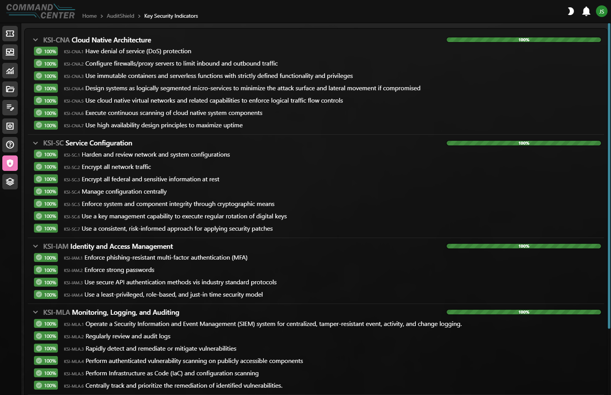
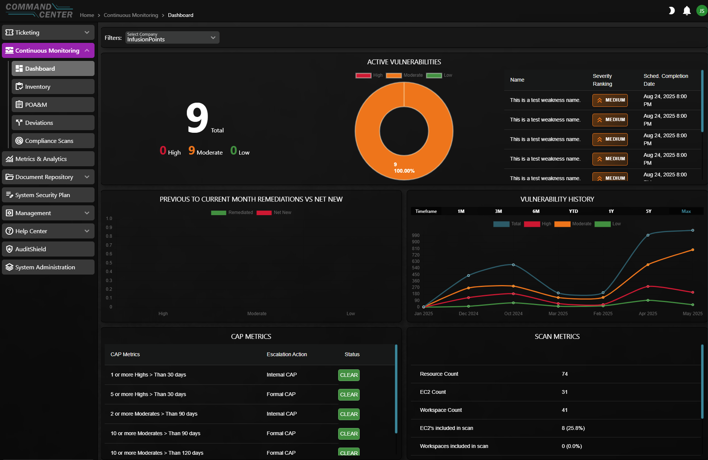

# Command Center on XBU40
InfusionPoints is pleased to submit our draft FedRAMP 20x package for Command Center on XBU40 and looks forward to feedback from the FedRAMP PMO and the public. 

Command Center is a cloud-native nextgen Governance, Risk, and Compliance (GRC) tool hosted in AWS GovCloud (US) that streamlines and orchestrates all aspects of FedRAMP and DoD ATOs including:

- Continuous Monitoring
- Audit Orchestration
- User Management
- Ticketing
- Document Management

## Solution Overview
Command Center is the interface for InfusionPoints' full-lifecycle managed hosting service XBU40 that provides for military grade security for hosting our customers' cloud environments and supported by our Cloud Operations and Security Operations teams. XBU40 was developed using opinionated, cloud-native security architectures that are audited annually for DoD Impact Level 4 on the FedRAMP Moderate baseline. We pioneered the concept of ATO acceleration and have assisted dozens of organizations in rapidly achieving and maintaining ATOs in FedRAMP and DoD. InfusionPoints is leaning into the FedRAMP 20x initiatve with AuditShield, our automated evidence collection capability to support continuous auditing and reporting on compliance status within Command Center. Command Center and AuditShield is also available in our XccelerATOr solution that we build and manage in a customers' enclave.

## AuditShield
AuditShield provides CSPs, 3PAOs, and Agency stakeholders alike with a reports view and gathers actionable insights for security and compliance status in real-time. InfusionPoints AuditShield provides CSPs with the ability to automate the evidence collection process for FedRAMP KSIs. Uniqely, AuditShield allows for live evidence views using APIs and serverless calls and maps output artifacts to specific KSI visualizations. The Command Center interface allows a 3PAO to attest to the validations by showing the exact commands used in each validation and the resulting output. The 3PAO can record their opinion on the outcome for each validation attestation and its sufficiency while the validation is free to run continuously. 

AuditShield provides details concerning what commands are run to gather KSI artifacts and provide stakeholders with the ability to track a full chain of custody of an artifact to their source within the environment. AuditShield will have capabilities to reflect evidence mapped to additional frameworks over time. 

## Submission Details
Our submission consists of three outputs:

| File | Description |
|----------|----------|
| [fedramp20x_automated_report_public.json](fedramp20x_automated_report_public.json)    | Point-in-time view of compliance status of all KSI validations, exportable from command center  |
| [KSI-IR.py](KSI-IR.py)   | Example of a technical validation (check)    |
| [3PAO KSI Methods Letter](InfusionPoints-FedRAMP_20x_KSIs-Methods-Letter-05232025.pdf)  | 3PAO Letter attestesting to our validation methods |

## 3PAO Review and Digital Signing
This draft submission package has been reviewed by Fortreum, the designated 3PAO for this engagement. As part of our validation process, we are testing digital signing capabilities using PGP keys to ensure the integrity and authenticity of submission artifacts.

### Audit Shield Dashboard

### ConMon Dashboard
